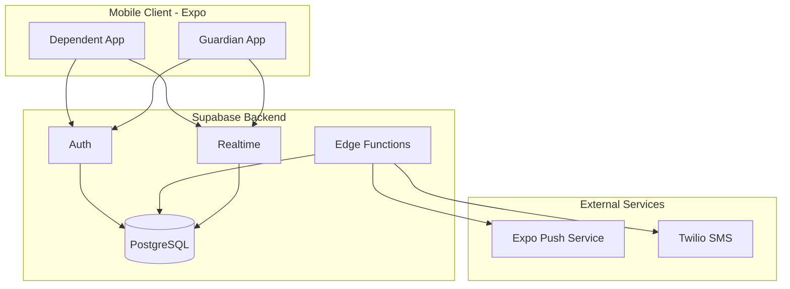
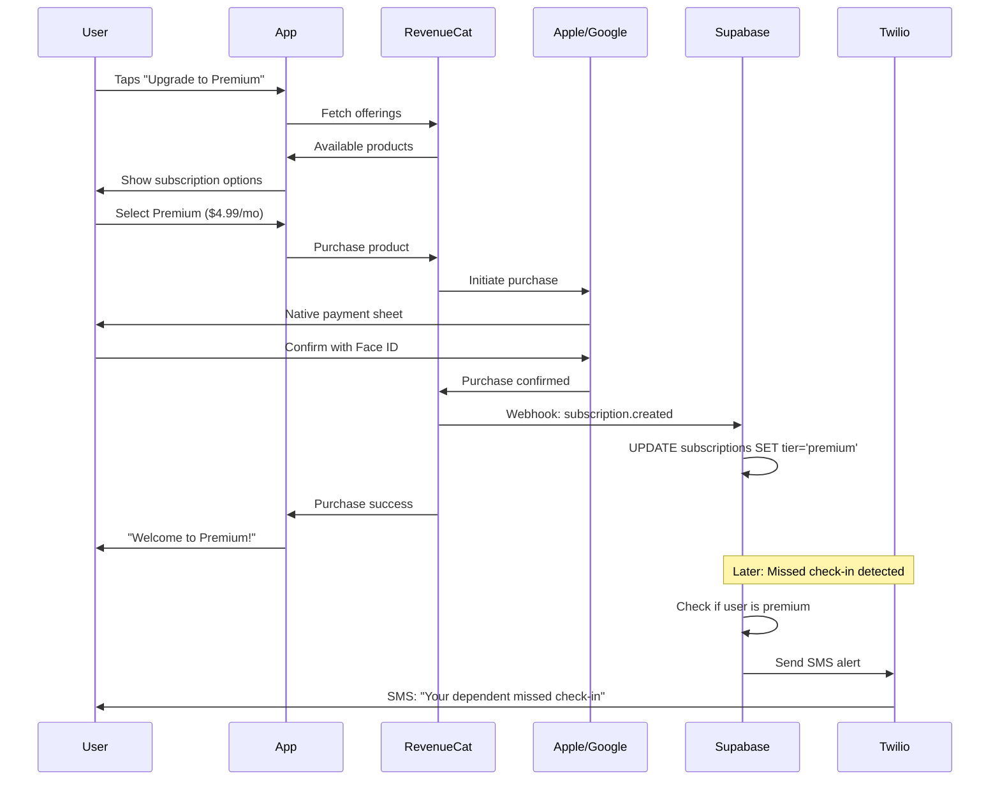
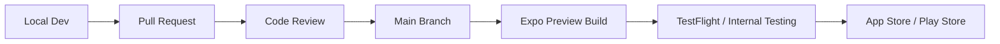

# I'm Okay - Product Requirements Document

## Executive Summary

**I'm Okay** is a mobile app that provides a simple, low-friction way for guardians to monitor the wellbeing of dependents (elderly, medically vulnerable individuals, or children) through scheduled check-ins. Dependents confirm they're okay with a single button press; guardians are notified of check-ins and alerted if one is missed.

---

## 1. Product Manager Perspective

### Problem Statement

Families with elderly parents, medically vulnerable relatives, or children living independently need peace of mind without being intrusive. Current solutions are either too complex, too expensive, or feel like surveillance.

### Target Users

| User Type | Description | Primary Need |
|-----------|-------------|--------------|
| **Guardian** | Adult family member, caregiver, or parent | Peace of mind, timely alerts |
| **Dependent** | Elderly person, medical patient, teen/child | Simple interaction, autonomy preserved |

### Core User Stories

**Dependent:**
- As a dependent, I can press one button to confirm I'm okay
- As a dependent, I receive a gentle reminder if I haven't checked in
- As a dependent, I can request help with a single tap

**Guardian:**
- As a guardian, I receive notifications when my dependent checks in
- As a guardian, I am alerted if a check-in is missed
- As a guardian, I can configure check-in schedules per dependent

### Monetization: Freemium Model

| Tier | Price | Features |
|------|-------|----------|
| **Free** | $0 | 1 dependent, 1 daily check-in window, push notifications |
| **Premium** | $4.99/month or $39.99/year | Unlimited dependents, multiple check-in windows, SMS alerts, ability for dependents to contact emergency services directly |
| **Family** | $7.99/month or $59.99/year | Premium + multiple guardians per dependent, shared dashboard |

### Success Metrics

- Daily Active Users (DAU) / Monthly Active Users (MAU)
- Check-in completion rate (target: >90%)
- Time from missed check-in to alert (<2 minutes)
- Free-to-Premium conversion rate (target: 5-10%)
- App Store rating (target: 4.5+)
- Positive user stories

---

## 2. Designer Perspective

### Design Principles

1. **Radical Simplicity** - The dependent UI must be usable by someone with limited tech experience or dexterity. Check-in button should be accessible on device lock-screen.
2. **Calm Technology** - Non-intrusive, no anxiety-inducing design patterns
3. **Accessibility First** - Large touch targets, high contrast, screen reader support
4. **Trust & Warmth** - Soft colors, friendly language, no clinical feel

### Reference Apps to Emulate

- **Life360** - Family circle concept, notification patterns
- **Calm** - Peaceful UI, soft animations
- **Apple Health** - Simple check-in interactions

### Design System Foundations

See [design-system.md](./design-system.md) for complete design specifications.

**Color Palette:**
```
Primary:      #4CAF50 (Calm Green - "I'm Okay")
Danger:       #E57373 (Soft Red - Alerts)
Background:   #F5F5F5 (Light) / #1A1A1A (Dark)
Text:         #212121 (Primary) / #757575 (Secondary)
Accent:       #7fbff2 (Actions)
```

**Typography:**
- Headlines: SF Pro Display / Roboto (32-48pt)
- Body: SF Pro Text / Roboto (16-18pt)
- Minimum touch target: 48x48pt

### Key Screens (Dependent App)

1. **Home** - Single large "I'm Okay" button (80% of screen)
2. **Lock Screen Widget** - Quick check-in without unlocking
3. **Help** - Emergency contact button
4. **Settings** - Minimal (notification preferences only)

### Key Screens (Guardian App)

1. **Dashboard** - List of dependents with status indicators
2. **Dependent Detail** - Check-in history, schedule config
3. **Alerts** - Missed check-in notifications
4. **Settings** - Account, subscription, notification preferences

### Design Assets Location

Export Figma designs to `/docs/designs/` for agent reference. See [designs/README.md](./designs/README.md) for required exports.

---

## 3. Engineer Perspective

### Technical Architecture



### Database Schema (Supabase/PostgreSQL)

```sql
-- Users table (extends Supabase auth.users)
create table profiles (
  id uuid references auth.users primary key,
  role text check (role in ('guardian', 'dependent')),
  display_name text,
  avatar_url text,
  push_token text,
  phone text,  -- for SMS alerts (premium)
  created_at timestamptz default now()
);

-- Guardian-Dependent relationships
create table relationships (
  id uuid primary key default gen_random_uuid(),
  guardian_id uuid references profiles(id),
  dependent_id uuid references profiles(id),
  status text default 'pending',  -- pending, active, removed
  created_at timestamptz default now()
);

-- Check-in schedules
create table schedules (
  id uuid primary key default gen_random_uuid(),
  relationship_id uuid references relationships(id),
  start_time time not null,        -- e.g., 09:00
  end_time time not null,          -- e.g., 10:00 (1hr window)
  days_of_week int[] not null,     -- [1,2,3,4,5] = Mon-Fri
  reminder_minutes int default 15, -- remind 15min before deadline
  is_active boolean default true,
  created_at timestamptz default now()
);

-- Check-in records
create table checkins (
  id uuid primary key default gen_random_uuid(),
  dependent_id uuid references profiles(id),
  schedule_id uuid references schedules(id),
  checked_in_at timestamptz default now(),
  status text default 'completed'  -- completed, missed, help_requested
);

-- Subscriptions (for freemium)
create table subscriptions (
  id uuid primary key default gen_random_uuid(),
  user_id uuid references profiles(id),
  tier text default 'free',  -- free, premium, family
  expires_at timestamptz,
  created_at timestamptz default now()
);
```

### Lock Screen Widget (MVP Core Feature)

The "I'm Okay" button must be accessible from the device lock screen for maximum accessibility and minimal friction.

**Technical Approach:**

| Platform | Technology | Requirements |
|----------|------------|--------------|
| iOS | WidgetKit (Swift) | iOS 16+, Xcode, expo-dev-client |
| Android | App Widgets (Kotlin) | Android 8+, expo-dev-client |

**Implementation Structure:**

```
/modules/
  /lock-screen-widget/
    /ios/
      ImOkayWidget.swift        # WidgetKit implementation
      ImOkayWidgetBundle.swift  # Widget entry point
    /android/
      ImOkayWidget.kt           # AppWidgetProvider implementation
      widget_layout.xml         # Widget UI layout
    index.ts                    # Expo module bridge
```

**iOS WidgetKit Flow:**
1. Widget displays "I'm Okay" button on lock screen
2. Tap triggers App Intent → opens app in background
3. App sends check-in to Supabase via shared App Group
4. Widget updates to show "Checked in at [time]"

**Android App Widget Flow:**
1. Widget displays "I'm Okay" button on lock screen
2. Tap triggers PendingIntent → BroadcastReceiver
3. Receiver sends check-in to Supabase
4. Widget refreshes via AppWidgetManager

**Development Workflow Change:**
- Requires `expo-dev-client` (custom development build)
- Cannot use Expo Go for testing widget functionality
- Native code in `/modules/` folder with Expo Modules API

---

### Premium Upgrade Flow (RevenueCat + Twilio)

The upgrade process is seamless - users never interact with Twilio directly.



**RevenueCat Setup:**
- Products configured in App Store Connect & Google Play Console
- RevenueCat syncs products and handles receipt validation
- Webhook endpoint: Supabase Edge Function `/functions/v1/revenuecat-webhook`

**Supabase Edge Function (webhook handler):**

```typescript
// supabase/functions/revenuecat-webhook/index.ts
Deno.serve(async (req) => {
  const event = await req.json();
  
  if (event.event.type === 'INITIAL_PURCHASE' || 
      event.event.type === 'RENEWAL') {
    const userId = event.event.app_user_id;
    const tier = event.event.product_id.includes('family') ? 'family' : 'premium';
    
    await supabase
      .from('subscriptions')
      .upsert({ user_id: userId, tier, expires_at: event.event.expiration_at });
  }
  
  return new Response('ok');
});
```

**User Experience:**
1. Tap "Upgrade" → Native Apple/Google payment sheet (1 tap)
2. Confirm with Face ID/fingerprint (1 tap)
3. Instant confirmation → Premium features enabled
4. SMS alerts now automatically sent on missed check-ins

---

### Key Technical Decisions

| Decision | Choice | Rationale |
|----------|--------|-----------|
| Lock screen widget | Native WidgetKit (iOS) + App Widgets (Android) | MVP requirement, best UX for accessibility |
| Development client | expo-dev-client | Required for native widget modules |
| Single or dual app? | Single codebase, role-based UI | Simpler maintenance, shared components |
| Push notifications | Expo Push + Supabase Edge Functions | Native feel, serverless scaling |
| SMS alerts | Twilio (premium only) | Reliable, industry standard |
| Subscription management | RevenueCat | Handles Apple/Google APIs, webhooks, analytics |
| Emergency Services Contact | Free & premium versions | Use native phone functionality |
| Background scheduling | Supabase pg_cron + Edge Functions | No client dependency for alerts |
| State management | React Context + Zustand | Simple for MVP, scalable |

### Project Structure

```
/app
  /(auth)              # Login, signup, onboarding
    login.tsx
    signup.tsx
    role-select.tsx
  /(dependent)         # Dependent-only screens
    index.tsx          # Big "I'm Okay" button
    help.tsx
  /(guardian)          # Guardian-only screens
    index.tsx          # Dashboard
    [dependentId].tsx  # Dependent detail
    add-dependent.tsx
  /(shared)            # Both roles
    settings.tsx
    subscription.tsx
  _layout.tsx          # Root layout with auth check

/modules                 # Native modules (expo-modules-core)
  /lock-screen-widget/
    /ios/              # WidgetKit Swift code
    /android/          # App Widget Kotlin code
    index.ts           # JS bridge

/components
  /ui                  # Base components (Button, Card, etc.)
  /dependent           # Dependent-specific components
  /guardian            # Guardian-specific components

/lib
  supabase.ts          # Supabase client
  notifications.ts     # Push notification helpers
  revenuecat.ts        # Subscription helpers
  
/hooks
  useAuth.ts
  useCheckins.ts
  useSubscription.ts

/types
  database.ts          # Generated from Supabase

/supabase
  /functions/
    revenuecat-webhook/  # Subscription webhook handler
    send-sms-alert/      # Twilio SMS function
    check-missed/        # Cron job for missed check-ins
```

### MVP Feature Checklist

**Phase 1 - Core:**
- [ ] Project setup with expo-dev-client (required for native modules)
- [ ] Auth flow (email/password)
- [ ] Role selection (guardian/dependent)
- [ ] Dependent: "I'm Okay" button + confirmation (in-app)
- [ ] Lock screen widget - iOS (WidgetKit)
- [ ] Lock screen widget - Android (App Widget)
- [ ] Guardian: Add dependent (invite code)
- [ ] Guardian: View dependent status
- [ ] Push notifications on check-in

**Phase 2 - Scheduling:**
- [ ] Guardian: Configure check-in schedule
- [ ] Dependent: Reminder notifications
- [ ] Missed check-in alerts (push notification)
- [ ] Check-in history
- [ ] Widget refresh after check-in window changes

**Phase 3 - Premium:**
- [ ] RevenueCat integration + products setup
- [ ] Subscription management UI
- [ ] Supabase webhook for subscription events
- [ ] Multiple dependents (premium)
- [ ] SMS alerts via Twilio (premium)
- [ ] Guardian analytics dashboard

---

## 4. DevOps Perspective

### Development Workflow



### Environment Strategy

| Environment | Purpose | Supabase Project |
|-------------|---------|------------------|
| Development | Local dev, feature branches | `imokay-dev` |
| Staging | Pre-release testing | `imokay-staging` |
| Production | Live app | `imokay-prod` |

### CI/CD Pipeline (GitHub Actions + EAS)

```yaml
# .github/workflows/ci.yml
name: CI
on: [push, pull_request]
jobs:
  lint-and-test:
    runs-on: ubuntu-latest
    steps:
      - uses: actions/checkout@v4
      - uses: actions/setup-node@v4
      - run: npm ci
      - run: npm run lint
      - run: npm run typecheck
      - run: npm test
```

```yaml
# .github/workflows/build.yml  
name: Build
on:
  push:
    branches: [main]
jobs:
  build:
    runs-on: ubuntu-latest
    steps:
      - uses: actions/checkout@v4
      - uses: expo/expo-github-action@v8
        with:
          eas-version: latest
          token: ${{ secrets.EXPO_TOKEN }}
      - run: npm ci
      - run: eas build --platform all --profile preview --non-interactive
```

### App Store Submission Checklist

**iOS (App Store Connect):**
- [ ] Apple Developer Account ($99/year)
- [ ] App Store Connect setup
- [ ] Privacy policy URL
- [ ] App screenshots (6.5", 5.5" iPhone, iPad)
- [ ] App review notes (test account credentials)
- [ ] Age rating questionnaire

**Android (Google Play Console):**
- [ ] Google Play Developer Account ($25 one-time)
- [ ] Play Console setup
- [ ] Privacy policy URL
- [ ] Feature graphic (1024x500)
- [ ] Screenshots (phone, tablet)
- [ ] Content rating questionnaire
- [ ] Data safety form

### Secrets Management

```
# Required secrets (store in EAS / GitHub Secrets)
SUPABASE_URL=
SUPABASE_ANON_KEY=
EXPO_PUBLIC_SUPABASE_URL=
EXPO_PUBLIC_SUPABASE_ANON_KEY=
TWILIO_ACCOUNT_SID=       # Premium feature
TWILIO_AUTH_TOKEN=        # Premium feature
REVENUECAT_API_KEY=       # Subscriptions
```

### Monitoring & Analytics

| Tool | Purpose |
|------|---------|
| Sentry | Error tracking, crash reporting |
| Expo Analytics | App usage, performance |
| Supabase Dashboard | Database metrics, auth stats |
| RevenueCat | Subscription analytics |

---

## Next Steps

1. **Set up project** - Initialize Expo app with expo-dev-client, configure Supabase
2. **Export Figma designs** - Add to `/docs/designs/` for agent context
3. **Begin Phase 1 implementation** - Auth + core check-in flow
4. **Implement lock screen widget** - iOS WidgetKit + Android App Widget
