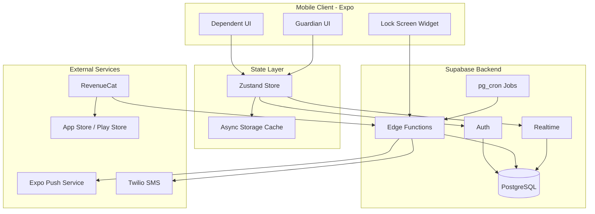

# I'm Okay - Implementation Plan

A comprehensive phased implementation plan for the "I'm Okay" safety check-in mobile app, covering project setup through premium features.

**Related Documents:**
- [Product Requirements Document](./PRD.md)
- [Design System](./design-system.md)
- [Design Assets](./designs/)

---

## Table of Contents

- [Phase 0: Project Setup](#phase-0-project-setup-expo-app-skeleton)
- [Phase 1: Core Features](#phase-1-core-features)
- [Phase 2: Scheduling](#phase-2-scheduling)
- [Phase 3: Premium Features](#phase-3-premium-features)
- [Architecture](#architecture-diagram)
- [Verification Checklist](#verification-checklist)

---

## Phase 0: Project Setup (Expo App Skeleton)

This phase establishes the foundation for the entire application, including the Expo project configuration, folder structure, design system implementation, and development environment.

### 0.1 Initialize Expo Project with expo-dev-client

```bash
npx create-expo-app@latest . --template blank-typescript
npx expo install expo-dev-client
```

**Key Configuration:**

| File | Configuration |
|------|---------------|
| `tsconfig.json` | Enable TypeScript strict mode |
| `app.json` / `app.config.ts` | App name "I'm Okay", bundle identifiers |
| `app.json` | iOS/Android configurations for native widgets |

**app.config.ts example structure:**
```typescript
export default {
  expo: {
    name: "I'm Okay",
    slug: "im-okay",
    version: "1.0.0",
    orientation: "portrait",
    icon: "./assets/icon.png",
    scheme: "imokay",
    userInterfaceStyle: "automatic",
    splash: { /* ... */ },
    ios: {
      bundleIdentifier: "com.imokay.app",
      supportsTablet: false,
      infoPlist: {
        UIBackgroundModes: ["remote-notification"],
      },
    },
    android: {
      package: "com.imokay.app",
      adaptiveIcon: { /* ... */ },
    },
    plugins: [
      "expo-router",
      "expo-secure-store",
      [
        "expo-notifications",
        {
          icon: "./assets/notification-icon.png",
          color: "#4CAF50",
        },
      ],
    ],
  },
};
```

### 0.2 Project Structure

Create the following folder structure:

```
/app
  /(auth)/                    # Authentication screens
    _layout.tsx               # Auth stack navigator
    login.tsx                 # Email/password login
    signup.tsx                # Registration
    role-select.tsx           # Guardian or Dependent selection
  /(dependent)/               # Dependent-only screens
    _layout.tsx               # Dependent tab navigator
    index.tsx                 # Main "I'm Okay" button
    help.tsx                  # Emergency contacts
    join.tsx                  # Enter invite code
  /(guardian)/                # Guardian-only screens
    _layout.tsx               # Guardian tab navigator
    index.tsx                 # Dashboard
    [dependentId].tsx         # Dependent detail
    add-dependent.tsx         # Invite dependent
    alerts.tsx                # Alert history
    schedule/
      [dependentId].tsx       # Schedule configuration
    analytics.tsx             # Premium analytics
  /(shared)/                  # Both roles
    settings.tsx              # Account settings
    subscription.tsx          # Premium upgrade
  _layout.tsx                 # Root layout with auth check
  +not-found.tsx              # 404 screen

/modules
  /lock-screen-widget/
    /ios/                     # WidgetKit (Swift)
      ImOkayWidget.swift
      ImOkayWidgetBundle.swift
    /android/                 # App Widget (Kotlin)
      ImOkayWidget.kt
      ImOkayWidgetReceiver.kt
      widget_layout.xml
    index.ts                  # Expo module bridge
    expo-module.config.json

/components
  /ui/                        # Base design system components
    Button.tsx
    Card.tsx
    Avatar.tsx
    StatusBadge.tsx
    Switch.tsx
    Input.tsx
    LoadingSpinner.tsx
  /dependent/                 # Dependent-specific components
    ImOkayButton.tsx
    CheckInConfirmation.tsx
  /guardian/                  # Guardian-specific components
    DependentCard.tsx
    StatusOverview.tsx
    AlertItem.tsx
    ScheduleEditor.tsx

/lib
  supabase.ts                 # Supabase client singleton
  notifications.ts            # Push notification helpers
  revenuecat.ts               # Subscription helpers
  linking.ts                  # Deep link configuration

/hooks
  useAuth.ts                  # Authentication state & methods
  useCheckins.ts              # Check-in operations
  useSubscription.ts          # Premium feature access
  useDependents.ts            # Guardian's dependent list
  useSchedules.ts             # Schedule management

/stores
  authStore.ts                # Zustand auth store
  checkInStore.ts             # Check-in state

/types
  database.ts                 # Supabase generated types
  navigation.ts               # Navigation param types

/constants
  Colors.ts                   # Color palette
  Typography.ts               # Type scale
  Spacing.ts                  # 8pt grid
  BorderRadius.ts             # Border radius tokens
  Shadows.ts                  # Platform shadows

/assets
  /images/
  /fonts/

/supabase
  /functions/
    /revenuecat-webhook/      # Subscription webhook
    /send-push-notification/  # Push notifications
    /send-sms-alert/          # Twilio SMS
    /check-missed/            # Missed check-in cron
    /send-reminder/           # Reminder notifications
  /migrations/                # Database migrations
```

### 0.3 Install Core Dependencies

**Navigation & Routing:**
```bash
npx expo install expo-router expo-linking expo-constants expo-status-bar
```

**Backend & State:**
```bash
npm install @supabase/supabase-js zustand
```

**UI Essentials:**
```bash
npx expo install expo-font expo-splash-screen react-native-safe-area-context react-native-screens react-native-gesture-handler react-native-reanimated
```

**Notifications:**
```bash
npx expo install expo-notifications expo-device
```

**Storage & Security:**
```bash
npx expo install expo-secure-store @react-native-async-storage/async-storage
```

**Utilities:**
```bash
npm install date-fns
npx expo install expo-haptics expo-linking
```

### 0.4 Design System Constants

Implement all design tokens from [design-system.md](./design-system.md):

**`constants/Colors.ts`**
```typescript
export const Colors = {
  light: {
    primary: '#4CAF50',
    primaryDark: '#388E3C',
    primaryLight: '#C8E6C9',
    danger: '#E57373',
    dangerDark: '#D32F2F',
    warning: '#FFB74D',
    accent: '#7FBFF2',
    background: '#F5F5F5',
    surface: '#FFFFFF',
    text: '#212121',
    textSecondary: '#757575',
    textDisabled: '#BDBDBD',
    border: '#E0E0E0',
  },
  dark: {
    primary: '#4CAF50',
    primaryDark: '#388E3C',
    primaryLight: '#1B5E20',
    danger: '#EF5350',
    dangerDark: '#C62828',
    warning: '#FFA726',
    accent: '#64B5F6',
    background: '#1A1A1A',
    surface: '#2D2D2D',
    text: '#FFFFFF',
    textSecondary: '#B0B0B0',
    textDisabled: '#666666',
    border: '#404040',
  },
};
```

**`constants/Typography.ts`**
```typescript
import { StyleSheet } from 'react-native';

export const Typography = StyleSheet.create({
  display: {
    fontSize: 48,
    fontWeight: '700',
    lineHeight: 56,
  },
  h1: {
    fontSize: 32,
    fontWeight: '700',
    lineHeight: 40,
  },
  h2: {
    fontSize: 24,
    fontWeight: '600',
    lineHeight: 32,
  },
  h3: {
    fontSize: 20,
    fontWeight: '600',
    lineHeight: 28,
  },
  body: {
    fontSize: 16,
    fontWeight: '400',
    lineHeight: 24,
  },
  bodySmall: {
    fontSize: 14,
    fontWeight: '400',
    lineHeight: 20,
  },
  caption: {
    fontSize: 12,
    fontWeight: '400',
    lineHeight: 16,
  },
  button: {
    fontSize: 16,
    fontWeight: '600',
    lineHeight: 24,
  },
});
```

**`constants/Spacing.ts`**
```typescript
export const Spacing = {
  xs: 4,
  sm: 8,
  md: 16,
  lg: 24,
  xl: 32,
  '2xl': 48,
  '3xl': 64,
};
```

**`constants/BorderRadius.ts`**
```typescript
export const BorderRadius = {
  sm: 4,
  md: 8,
  lg: 16,
  xl: 24,
  full: 9999,
};
```

**`constants/Shadows.ts`**
```typescript
import { Platform } from 'react-native';

export const Shadows = {
  sm: Platform.select({
    ios: {
      shadowColor: '#000',
      shadowOffset: { width: 0, height: 1 },
      shadowOpacity: 0.1,
      shadowRadius: 2,
    },
    android: {
      elevation: 2,
    },
  }),
  md: Platform.select({
    ios: {
      shadowColor: '#000',
      shadowOffset: { width: 0, height: 2 },
      shadowOpacity: 0.15,
      shadowRadius: 4,
    },
    android: {
      elevation: 4,
    },
  }),
  lg: Platform.select({
    ios: {
      shadowColor: '#000',
      shadowOffset: { width: 0, height: 4 },
      shadowOpacity: 0.2,
      shadowRadius: 8,
    },
    android: {
      elevation: 8,
    },
  }),
};
```

### 0.5 Base UI Components

Create reusable components matching the figma-reference designs:

| Component | File | Purpose | Key Props |
|-----------|------|---------|-----------|
| Button | `components/ui/Button.tsx` | Primary, Secondary, Danger variants | `variant`, `size`, `loading`, `disabled`, `onPress` |
| Card | `components/ui/Card.tsx` | Surface container with shadow | `children`, `padding`, `style` |
| Avatar | `components/ui/Avatar.tsx` | User initials with status | `initials`, `status`, `size` |
| StatusBadge | `components/ui/StatusBadge.tsx` | ok/pending/missed indicators | `status` |
| Switch | `components/ui/Switch.tsx` | Toggle control | `checked`, `onCheckedChange` |
| Input | `components/ui/Input.tsx` | Text input with label | `label`, `error`, `placeholder`, `secureTextEntry` |
| LoadingSpinner | `components/ui/LoadingSpinner.tsx` | Activity indicator | `size`, `color` |

**Critical Accessibility Requirements:**
- Minimum touch target: **48x48pt** (per design system)
- All interactive elements must have `accessibilityLabel`
- Support for `accessibilityRole` and `accessibilityState`
- Respect system font scaling
- Support "Reduce Motion" preference

### 0.6 Navigation Structure (Expo Router)

**`app/_layout.tsx`** - Root layout:
```typescript
import { useEffect } from 'react';
import { Stack } from 'expo-router';
import { useAuth } from '@/hooks/useAuth';
import { ThemeProvider } from '@/providers/ThemeProvider';

export default function RootLayout() {
  const { session, loading } = useAuth();

  if (loading) {
    return <LoadingScreen />;
  }

  return (
    <ThemeProvider>
      <Stack screenOptions={{ headerShown: false }}>
        {!session ? (
          <Stack.Screen name="(auth)" />
        ) : (
          <>
            <Stack.Screen name="(dependent)" />
            <Stack.Screen name="(guardian)" />
            <Stack.Screen name="(shared)" />
          </>
        )}
      </Stack>
    </ThemeProvider>
  );
}
```

**`app/(auth)/_layout.tsx`** - Auth stack navigator
**`app/(dependent)/_layout.tsx`** - Tab navigator (Home, Help, Settings)
**`app/(guardian)/_layout.tsx`** - Tab navigator (Dashboard, Alerts, Settings)

### 0.7 Environment Configuration

**`.env.example`**
```
EXPO_PUBLIC_SUPABASE_URL=https://your-project.supabase.co
EXPO_PUBLIC_SUPABASE_ANON_KEY=your-anon-key
```

**`lib/supabase.ts`**
```typescript
import 'react-native-url-polyfill/auto';
import { createClient } from '@supabase/supabase-js';
import * as SecureStore from 'expo-secure-store';
import { Database } from '@/types/database';

const supabaseUrl = process.env.EXPO_PUBLIC_SUPABASE_URL!;
const supabaseAnonKey = process.env.EXPO_PUBLIC_SUPABASE_ANON_KEY!;

const ExpoSecureStoreAdapter = {
  getItem: (key: string) => SecureStore.getItemAsync(key),
  setItem: (key: string, value: string) => SecureStore.setItemAsync(key, value),
  removeItem: (key: string) => SecureStore.deleteItemAsync(key),
};

export const supabase = createClient<Database>(supabaseUrl, supabaseAnonKey, {
  auth: {
    storage: ExpoSecureStoreAdapter,
    autoRefreshToken: true,
    persistSession: true,
    detectSessionInUrl: false,
  },
});
```

### 0.8 Development Build Setup

Since lock screen widgets require native code, we cannot use Expo Go:

```bash
# Generate native projects
npx expo prebuild

# Run on iOS simulator
npx expo run:ios

# Run on Android emulator
npx expo run:android
```

**`eas.json`** - EAS Build configuration:
```json
{
  "cli": {
    "version": ">= 5.0.0"
  },
  "build": {
    "development": {
      "developmentClient": true,
      "distribution": "internal",
      "ios": {
        "simulator": true
      }
    },
    "preview": {
      "distribution": "internal"
    },
    "production": {}
  },
  "submit": {
    "production": {}
  }
}
```

---

## Phase 1: Core Features

### 1.1 Authentication Flow

**Screens:**

| Screen | Path | Description |
|--------|------|-------------|
| Login | `app/(auth)/login.tsx` | Email/password login |
| Signup | `app/(auth)/signup.tsx` | Registration with email verification |
| Role Select | `app/(auth)/role-select.tsx` | Guardian or Dependent selection (post-signup) |

**Backend Setup:**
- Enable Supabase Auth with email/password provider
- Create database trigger to insert `profiles` record on new user signup
- Implement Row Level Security (RLS) policies for `profiles` table

**`hooks/useAuth.ts`:**
```typescript
export function useAuth() {
  // Returns: session, user, profile, loading, error
  // Methods: signIn, signUp, signOut, updateProfile
}
```

### 1.2 Dependent Home Screen

**`app/(dependent)/index.tsx`**

Based on [DependentHome.tsx](./figma-reference/src/components/dependent/DependentHome.tsx):

- Large circular "I'm Okay" button (256x256pt minimum)
- Gradient background (`#E8F5E9` to `#F5F5F5`)
- Heart icon centered in button
- Last check-in timestamp display
- Quick action buttons: Help, Settings (min 48x48pt touch targets)
- Success animation with haptic feedback

**`components/dependent/ImOkayButton.tsx`:**
- Press animation (scale to 0.95) using `react-native-reanimated`
- Success pulse animation expanding from center
- Checkmark icon transition on completion
- Haptic feedback via `expo-haptics`
- Loading state while submitting

### 1.3 Dependent Help Screen

**`app/(dependent)/help.tsx`**

Based on [DependentHelp.tsx](./figma-reference/src/components/dependent/DependentHelp.tsx):

- Emergency notice banner (red background)
- Emergency contacts list with:
  - Guardian contact info
  - Emergency Services (911)
- Large Call/Message buttons using native `tel:` and `sms:` linking
- "How to Use I'm Okay" quick tips section

### 1.4 Guardian Dashboard

**`app/(guardian)/index.tsx`**

Based on [GuardianDashboard.tsx](./figma-reference/src/components/guardian/GuardianDashboard.tsx):

- Status overview cards:
  - All Good count (green)
  - Pending count (blue/accent)
  - Missed count (red)
- "Your Circle" dependent list:
  - Avatar with status indicator badge
  - Name and relationship
  - Last check-in time
  - Next expected check-in
- "Add Dependent" button (premium gated for >1 dependent)

### 1.5 Guardian Dependent Detail

**`app/(guardian)/[dependentId].tsx`**

Based on [GuardianDependentDetail.tsx](./figma-reference/src/components/guardian/GuardianDependentDetail.tsx):

- Back navigation
- Dependent profile header with:
  - Large avatar with status badge
  - Name and relationship
  - Call/Message quick action buttons
- Current status card:
  - Status badge
  - Last check-in time
  - Next expected time
  - Alert toggle switch
- Check-in schedule display (view mode)
- "Edit Schedule" button
- Recent check-in history list

### 1.6 Guardian Alerts Screen

**`app/(guardian)/alerts.tsx`**

Based on [GuardianAlerts.tsx](./figma-reference/src/components/guardian/GuardianAlerts.tsx):

- New notifications count badge
- "Mark All Read" action button
- Alert list grouped by type:
  - Missed (red) - with "Call Now" action
  - Late (blue) - with "Dismiss" action
  - Completed (green)
- Empty state when no alerts
- "Alert Settings" promo card

### 1.7 Guardian Add Dependent Flow

**`app/(guardian)/add-dependent.tsx`:**

- Generate 6-character alphanumeric invite code
- Display code prominently for sharing
- "Share Code" button using native share sheet
- Alternative: Enter dependent's email to send invite
- Instructions text for dependent

**`app/(dependent)/join.tsx`:**

- 6-digit code input field
- "Join" button
- Creates `relationships` record with status `pending`
- Guardian confirms to set status to `active`

### 1.8 Supabase Database Schema

Implement the schema from [PRD.md](./PRD.md):

```sql
-- Users table (extends Supabase auth.users)
create table profiles (
  id uuid references auth.users primary key,
  role text check (role in ('guardian', 'dependent')),
  display_name text,
  avatar_url text,
  push_token text,
  phone text,
  created_at timestamptz default now()
);

-- Guardian-Dependent relationships
create table relationships (
  id uuid primary key default gen_random_uuid(),
  guardian_id uuid references profiles(id),
  dependent_id uuid references profiles(id),
  invite_code text unique,
  status text default 'pending',
  created_at timestamptz default now()
);

-- Check-in schedules
create table schedules (
  id uuid primary key default gen_random_uuid(),
  relationship_id uuid references relationships(id),
  start_time time not null,
  end_time time not null,
  days_of_week int[] not null,
  reminder_minutes int default 15,
  is_active boolean default true,
  created_at timestamptz default now()
);

-- Check-in records
create table checkins (
  id uuid primary key default gen_random_uuid(),
  dependent_id uuid references profiles(id),
  schedule_id uuid references schedules(id),
  checked_in_at timestamptz default now(),
  status text default 'completed'
);

-- Subscriptions
create table subscriptions (
  id uuid primary key default gen_random_uuid(),
  user_id uuid references profiles(id),
  tier text default 'free',
  revenuecat_customer_id text,
  expires_at timestamptz,
  created_at timestamptz default now()
);

-- Indexes for performance
create index idx_checkins_dependent on checkins(dependent_id);
create index idx_checkins_schedule on checkins(schedule_id);
create index idx_relationships_guardian on relationships(guardian_id);
create index idx_relationships_dependent on relationships(dependent_id);
create index idx_relationships_invite_code on relationships(invite_code);
```

**RLS Policies:**
```sql
-- Profiles: users can only access their own profile
alter table profiles enable row level security;
create policy "Users can view own profile" on profiles
  for select using (auth.uid() = id);
create policy "Users can update own profile" on profiles
  for update using (auth.uid() = id);

-- Relationships: guardians can see their relationships
create policy "Guardians can view their relationships" on relationships
  for select using (auth.uid() = guardian_id);
create policy "Dependents can view their relationships" on relationships
  for select using (auth.uid() = dependent_id);

-- Check-ins: dependents can create, guardians can view
create policy "Dependents can create check-ins" on checkins
  for insert with check (auth.uid() = dependent_id);
create policy "Guardians can view dependent check-ins" on checkins
  for select using (
    exists (
      select 1 from relationships
      where relationships.guardian_id = auth.uid()
      and relationships.dependent_id = checkins.dependent_id
      and relationships.status = 'active'
    )
  );
```

### 1.9 Check-in API Integration

**`hooks/useCheckins.ts`:**
```typescript
export function useCheckins() {
  // Methods:
  // - createCheckIn(): Promise<void>
  // - getCheckInHistory(dependentId?: string): Promise<CheckIn[]>
  // - subscribeToCheckIns(callback): Unsubscribe
  // - getLastCheckIn(): Promise<CheckIn | null>
  
  // Uses Supabase Realtime for live updates
}
```

### 1.10 Push Notifications Setup

**Configuration:**
1. Configure `expo-notifications` in `app.json`
2. Request permissions on app launch (dependent) or when adding first dependent (guardian)
3. Store push tokens in `profiles.push_token`

**`lib/notifications.ts`:**
```typescript
export async function registerForPushNotifications(): Promise<string | null>;
export async function sendLocalNotification(title: string, body: string): Promise<void>;
```

**Supabase Edge Function: `send-push-notification`**
- Receives: `user_id`, `title`, `body`
- Fetches push token from profiles
- Sends via Expo Push API

### 1.11 Lock Screen Widget - iOS (WidgetKit)

**`modules/lock-screen-widget/ios/`**

| File | Purpose |
|------|---------|
| `ImOkayWidget.swift` | Main widget view and timeline provider |
| `ImOkayWidgetBundle.swift` | Widget bundle entry point |
| `ImOkayIntent.swift` | App Intent for check-in action |

**Features:**
- Small circular widget (lock screen)
- Medium rectangular widget (home screen)
- Displays "I'm Okay" button
- Shows last check-in time
- App Intent triggers check-in without opening app
- Shared App Group for data sync with main app
- `WidgetCenter.shared.reloadAllTimelines()` after check-in

### 1.12 Lock Screen Widget - Android (App Widget)

**`modules/lock-screen-widget/android/`**

| File | Purpose |
|------|---------|
| `ImOkayWidget.kt` | AppWidgetProvider implementation |
| `ImOkayWidgetReceiver.kt` | BroadcastReceiver for tap action |
| `widget_layout.xml` | Widget UI layout (2x2 cells minimum) |
| `widget_provider_info.xml` | Widget metadata |

**Features:**
- 2x2 minimum size widget
- Large "I'm Okay" button
- Last check-in timestamp
- PendingIntent triggers BroadcastReceiver
- `AppWidgetManager.updateAppWidget()` after check-in

### 1.13 Expo Module Bridge

**`modules/lock-screen-widget/index.ts`:**
```typescript
import { NativeModulesProxy, EventEmitter } from 'expo-modules-core';

export function triggerCheckIn(): Promise<void>;
export function updateWidgetStatus(lastCheckIn: Date): Promise<void>;
export function getLastCheckIn(): Promise<Date | null>;
```

---

## Phase 2: Scheduling

### 2.1 Guardian Schedule Configuration

**`app/(guardian)/schedule/[dependentId].tsx`:**

- Time picker for check-in window:
  - Start time (e.g., 9:00 AM)
  - End time (e.g., 10:00 AM)
- Day-of-week multi-select (Mon-Sun checkboxes)
- Reminder timing selector (15, 30, 60 minutes before)
- Save button
- Delete schedule option

**Data flow:**
1. Guardian configures schedule
2. Save to `schedules` table
3. Notify dependent's app to refresh
4. Update widget with new schedule

### 2.2 Dependent Reminder Notifications

**Supabase `pg_cron` job:**
```sql
-- Run every minute to check for upcoming reminders
select cron.schedule(
  'check-upcoming-reminders',
  '* * * * *',
  $$
    select net.http_post(
      url := 'https://your-project.supabase.co/functions/v1/send-reminder',
      headers := '{"Authorization": "Bearer service_role_key"}'::jsonb
    );
  $$
);
```

**Edge Function: `send-reminder`**
- Query schedules where reminder time is now
- Check if check-in already completed for today
- Send push notification: "Time to check in!"

### 2.3 Missed Check-in Detection

**Edge Function: `check-missed`**
```typescript
// Runs every 5 minutes via pg_cron
// 1. Query schedules where window has passed
// 2. Check if check-in exists for that window
// 3. If not, create checkin record with status 'missed'
// 4. Send push notification to all guardians
// 5. If guardian is premium, also send SMS
```

### 2.4 Check-in History Views

**Guardian view:**
- Full history per dependent
- Filter by date range
- Filter by status (all, completed, missed)
- Export option (premium)

**Dependent view:**
- Simple recent list (last 30 days)
- Status indicators

### 2.5 Widget Schedule Sync

When schedule changes:
1. Main app updates schedule in Supabase
2. Broadcast to widget native code
3. iOS: `WidgetCenter.shared.reloadAllTimelines()`
4. Android: `AppWidgetManager.updateAppWidget()`
5. Widget displays next check-in time

---

## Phase 3: Premium Features

### 3.1 RevenueCat Integration

```bash
npm install react-native-purchases
```

**Setup steps:**
1. Create RevenueCat account and project
2. Configure products in App Store Connect:
   - `premium_monthly` - $4.99/month
   - `premium_yearly` - $39.99/year
   - `family_monthly` - $7.99/month
   - `family_yearly` - $59.99/year
3. Configure same products in Google Play Console
4. Link stores to RevenueCat
5. Configure webhook URL to Supabase Edge Function

**`lib/revenuecat.ts`:**
```typescript
import Purchases from 'react-native-purchases';

export async function initializePurchases(userId: string): Promise<void>;
export async function getOfferings(): Promise<PurchasesOfferings>;
export async function purchasePackage(pkg: PurchasesPackage): Promise<void>;
export async function restorePurchases(): Promise<void>;
export async function getCustomerInfo(): Promise<CustomerInfo>;
```

### 3.2 Subscription Management UI

**`app/(shared)/subscription.tsx`:**

- Current plan display with expiration date
- Feature comparison table:

| Feature | Free | Premium | Family |
|---------|------|---------|--------|
| Dependents | 1 | Unlimited | Unlimited |
| Check-in windows | 1/day | Multiple | Multiple |
| Push notifications | Yes | Yes | Yes |
| SMS alerts | No | Yes | Yes |
| Multiple guardians | No | No | Yes |
| Analytics | No | Yes | Yes |

- Upgrade buttons with native payment sheet
- Restore purchases button
- Cancel subscription link (opens store settings)

### 3.3 RevenueCat Webhook Handler

**`supabase/functions/revenuecat-webhook/index.ts`:**
```typescript
Deno.serve(async (req) => {
  // Verify webhook signature
  const signature = req.headers.get('X-RevenueCat-Signature');
  
  const event = await req.json();
  
  switch (event.event.type) {
    case 'INITIAL_PURCHASE':
    case 'RENEWAL':
      await updateSubscription(
        event.event.app_user_id,
        getTierFromProductId(event.event.product_id),
        event.event.expiration_at_ms
      );
      break;
    case 'CANCELLATION':
    case 'EXPIRATION':
      await updateSubscription(
        event.event.app_user_id,
        'free',
        null
      );
      break;
  }
  
  return new Response('ok');
});
```

### 3.4 Premium Feature Gates

**`hooks/useSubscription.ts`:**
```typescript
export function useSubscription() {
  return {
    tier: 'free' | 'premium' | 'family',
    isPremium: boolean,
    isFamily: boolean,
    canAddMoreDependents: () => boolean,
    canUseSmsAlerts: () => boolean,
    canHaveMultipleGuardians: () => boolean,
    canAccessAnalytics: () => boolean,
    dependentLimit: number, // 1 for free, Infinity for premium
  };
}
```

### 3.5 SMS Alerts via Twilio

**`supabase/functions/send-sms-alert/index.ts`:**
```typescript
import { Twilio } from 'twilio';

Deno.serve(async (req) => {
  const { guardian_id, dependent_name, check_in_time } = await req.json();
  
  // Verify guardian is premium
  const { data: subscription } = await supabase
    .from('subscriptions')
    .select('tier')
    .eq('user_id', guardian_id)
    .single();
    
  if (subscription?.tier === 'free') {
    return new Response('Premium required', { status: 403 });
  }
  
  // Get guardian phone number
  const { data: profile } = await supabase
    .from('profiles')
    .select('phone')
    .eq('id', guardian_id)
    .single();
    
  if (!profile?.phone) {
    return new Response('No phone number', { status: 400 });
  }
  
  // Send SMS via Twilio
  const client = new Twilio(
    Deno.env.get('TWILIO_ACCOUNT_SID'),
    Deno.env.get('TWILIO_AUTH_TOKEN')
  );
  
  await client.messages.create({
    to: profile.phone,
    from: Deno.env.get('TWILIO_PHONE_NUMBER'),
    body: `I'm Okay Alert: ${dependent_name} missed their check-in at ${check_in_time}. Open the app to check on them.`,
  });
  
  return new Response('SMS sent');
});
```

### 3.6 Multiple Dependents (Premium)

- Free tier: Limited to 1 dependent
- Premium/Family tier: Unlimited dependents
- Guardian dashboard shows all dependents
- "Add Dependent" button always visible but shows upgrade prompt for free users at limit

### 3.7 Multiple Guardians (Family)

- Family tier only
- Dependent can accept invites from multiple guardians
- All guardians receive check-in notifications
- All guardians can view dependent status
- Shared alert history

### 3.8 Guardian Analytics Dashboard

**`app/(guardian)/analytics.tsx`:**

Premium feature showing:
- Check-in completion rate chart (line graph, last 30 days)
- Weekly/monthly trend comparison
- Streak tracking (consecutive days checked in)
- Calendar heatmap view
- Export data as CSV option

---

## Architecture Diagram



---

## Verification Checklist

### Design System Compliance

- [x] Color palette with semantic colors (Primary, Danger, Warning, Accent)
- [x] Typography scale (Display 48pt to Caption 12pt)
- [x] 8pt spacing grid
- [x] Border radius tokens
- [x] Platform-specific shadows (iOS shadow, Android elevation)
- [x] Dark mode support with alternate color values
- [x] 48x48pt minimum touch targets
- [x] WCAG 2.1 AA color contrast requirements
- [x] Animation timing guidelines (100ms micro, 200ms standard, 300ms emphasis)

### Accessibility

- [x] Screen reader support with accessible labels
- [x] Reduce Motion preference respect
- [x] High contrast mode support
- [x] Large touch targets for elderly users
- [x] Font scaling support

### Technical Requirements

- [x] expo-dev-client for native widget modules
- [x] Single codebase with role-based UI
- [x] Supabase for auth, database, realtime, edge functions
- [x] RLS policies for all tables
- [x] pg_cron for missed check-in detection
- [x] Expo Push for notifications
- [x] RevenueCat for subscriptions
- [x] Twilio for SMS (premium)

### Lock Screen Widget

- [x] iOS WidgetKit with App Intent
- [x] Android App Widget with BroadcastReceiver
- [x] Widget refresh after check-in and schedule changes

### Additional Considerations

- [x] Offline handling - graceful degradation when no network
- [x] Expo EAS build configuration for CI/CD
- [x] App Store / Play Store submission requirements
- [x] Privacy policy and terms of service screens
- [x] Onboarding flow for first-time users
- [x] Deep linking for invite codes
- [x] Error boundary components
- [x] Sentry error tracking setup
- [x] Rate limiting on Edge Functions
- [x] Database indexes for query performance

---

## Phase Summary

| Phase | Focus | Key Deliverables |
|-------|-------|------------------|
| **0** | Project Setup | Expo skeleton, design system, folder structure, dev builds |
| **1** | Core Features | Auth, check-in flow, widgets, push notifications, database |
| **2** | Scheduling | Schedule config, reminders, missed detection, history |
| **3** | Premium | RevenueCat, SMS alerts, multiple dependents/guardians, analytics |
